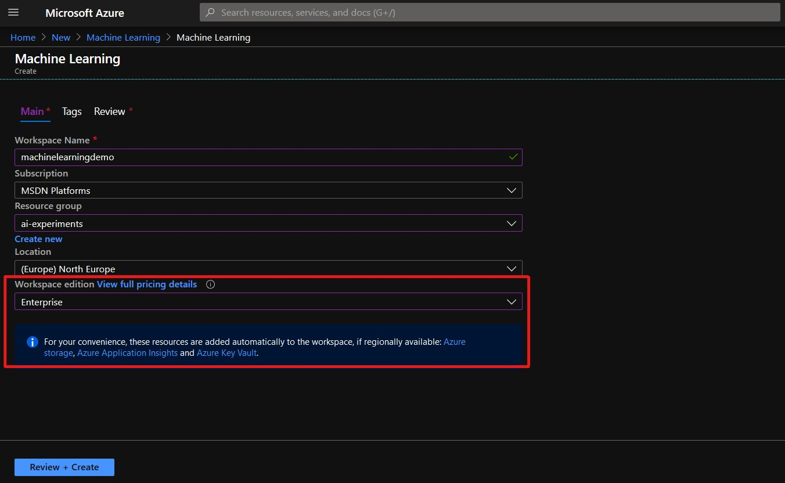
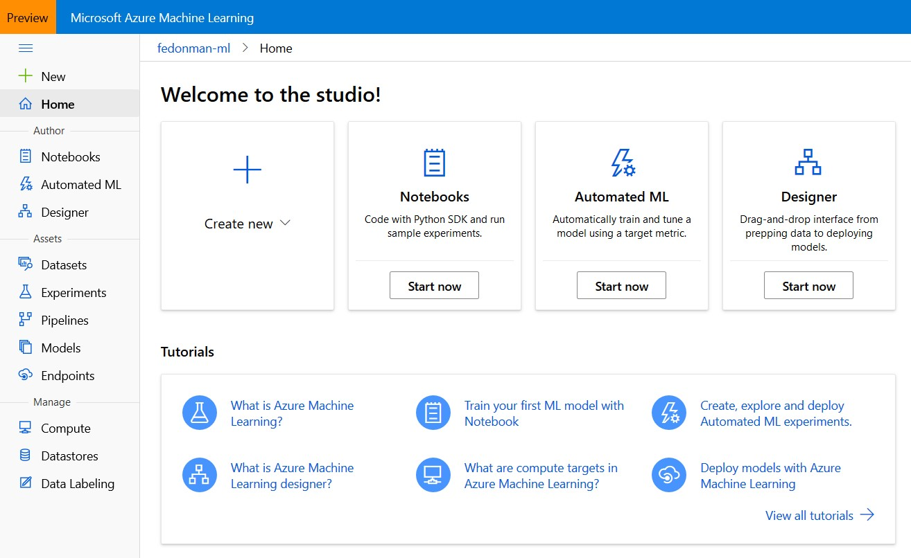

Managing a cloud-based Machine Learning solution can be tedious. Though the resources and the abilities are out there, sometimes finding the correct cloud-based product or service to adopt for your solution might be a problem.

Providing a perfect answer for that issue, Azure has come up with the whole new Azure Machine Learning Studio which is in preview by the time of this post. Don't get confused with the old AzureML Studio, the drag and drop interface we had before. This is a new thing. There's no framework dependency or restrictions for using these services. You can easily adapt your open source machine learning code base (may be written with Python, sci-kit learn, TensorFlow, PyTorch, Keras… anything).

In order to use this one-stop solution in Azure you have to create an Azure Machine Learning workspace from Azure portal. A workspace is a context for the experiments, data, compute targets, and other assets associated with a machine learning workload. Workspaces are Azure resources, and as such they are defined within a resource group in an Azure
subscription, along with other related Azure resources that are required to support the workspace.

The Azure resources created alongside a workspace include:

* **Storage Account.** Used to store files used by the workspace as well as data for experiments and model training.
* **Application Insights.** Used to monitor predictive services in the workspace.
* **Azure Key Vault.** Used to manage secrets such as authentication keys and credentials used
by the workspace.
* **Virtual Machines.** VMs and their associated virtual hardware resources are used to provide compute for notebook development in the workspace.
* **Container Registry.** Used to manage containers for deployed models.

When creating an Azure Machine Learning workspace, you can either go for the Enterprise pricing tier or for the Basic tier. Howeber, in basic tier you won't get the visual designer and Automated ML features. So, make sure you have selected the Enterprise tier.

When Azure Machine Learning resource is successfuly deployed you can access the new Studio interface by visiting [https://ml.azure.com](https://ml.azure.com). The interface is pretty familiar with other Microsoft apps and products. Let’s go through each and every tab we got in the side pane in the latest release and see what can we do with them.

## Notebooks

These are fully managed Jupyter notebook instances on cloud. These notebook servers are running on top of a new VM instance type called "notebookVM". There notebookVMs are fully configured work environments to do your machine learning and data science tasks. No need to worry about installing all the python packages and its dependencies. Many are already there! You have the privilege to change the notebook sizes (yes, GPU enabled VMs are also there) or install new packages through the python package manager.

## Automated ML

This feature is not available in the basic tier. Automated ML is a process of selecting the best suited algorithm for the dataset you are having. Right now, this is supporting classification, regression and time series forecasting for tabular data formats. There is no support for deep learning based computer vision applications yet. Deep learning based text analysis is also in preview. The Automated ML process runs a set of machine learning algorithms on top of your provided data and see which one gives the best accuracy metric. This is useful for building prototypes and evaluating the best algorithms to use in production.

## Designer

This is the evolution of Azure ML Studio (old drag-n-drop interface) and is available only in Enterprise tier. Here you can build the complete ML workflow by dragging and dropping modules. Azure Machine Learning Designer includes modules for training, scoring, and evaluating machine learning models. If you want can integrate custom SQL, R or Python scripts in the experiment. The machine learning service endpoint can be exposed through a Azure Kubernetes Service (AKS) deployment.

## Datasets

The place to manage and version your datasets. Datasets are versioned packaged data objects that can be easily consumed in experiments and pipelines. Datasets are the recommended way to work with data, and are the primary mechanism for advanced Azure Machine Learning capabilities like data labeling and data drift monitoring. Datasets can be either tabular or file based. Here you can profile your dataset by performing a basic statistical analysis on your data. If your dataset is sitting on a datastore this acts as a high-level encapsulation of that data.

## Experiments

Data science involves running experiments; typically to explore data or to build and evaluate predictive models. In Azure Machine Learning, an experiment is a named process, usually the running of a script or a pipeline, that can generate metrics and outputs and be tracked in the Azure Machine Learning workspace. You may execute several runs on the same experiment with different configurations. This is the place where you can view run history and compare results for each run.

## Pipelines

Don't confuse the Azure Machine Learning pipelines with the Azure pipelines. Azure ML pipelines are specifically designed for ML operation tasks. You can manage the whole experiment process till production using ML pipelines. These pipelines are reusable and help collaborative development of the solution.

## Models

You can register the trained ML models here. Versioning the models, managing which model to go for production are some use cases of this model registry. You can also register models that have been trained outside the particular Azure ML workspace.

## Endpoints

An endpoint of an Azure Machine Learning experiment can be a web service or an IoT module endpoint. Managing the endpoint settings are performed in this section.

## Compute

In most of the cases, you need to use Azure for computations. In the Compute section you can create and manage a variaty of compute resource types.

* **Notebook VMs.** As we discussed previously in the Notebooks section this is a fully managed ML development environment suited for development and prototyping purposes.
* **Training Clusters.** You can make either a CPU based or a GPU based cluster for running your experiments. Note that this would be charged according to the computation hours as well as for the number of nodes you are using. Good thing is there's no charge when you are not using the cluster for computation.
* **Inference Clusters.** To deploy trained models as production services, you can use Azure Machine Learning inference clusters, which use containerization technologies to enable rapid initialization of compute for on-demand inferencing.
* **Attached Compute.** If you already use an Azure-based compute environment for data science, such as a virtual machine or an Azure Databricks cluster, you can attach it to your Azure Machine Learning workspace and use it as a compute target for certain types of workload.

## Datastores

When it comes to machine learning experiments its normal to have large amount of data. Datastore is the storage abstraction over an Azure storage account which you can use inside your machine learning experiments. Azure Machine Learning supports the creation of datastores for multiple kinds of Azure data source, including Azure Storage (blob and file containers), Azure Data Lake stores, Azure SQL Database, Azure Databricks file system (DBFS) and others. The ability to define a datastore enables you to reuse data across multiple experiments, regardless of the compute context in which the experiment is running.

## Data Labeling

A cool new feature for data annotators. Right now, this supports image classification in multi-label / multi-class and object detection (bounding box) annotations. It is not mandatory for the annotator to be in an Azure subscription. You can easily outsource your tedious annotation workload through this feature.

This is just an overview of the options we are having with new Azure Machine Learning Studio. It's pretty clear that the Azure team is going to get all the ML related services under one umbrella. Let's discuss some cool use cases and tips on using these services in next blog posts.

Happy coding! :monkey:
