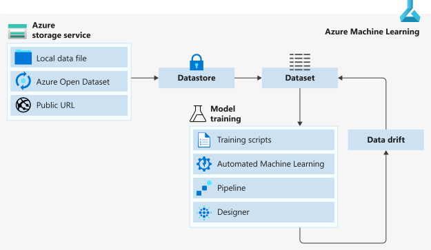

Being the fundamental and the most vital factor in any machine learning experiment, the way of handling data in your experiments is crucial. Here we going to discuss different ways of managing your data sources inside Azure Machine Learning (AML).

Since the new Azure Machine Learning Service is becoming the one-stop place for managing all ML related workloads in Azure, the functions and methods can be created/managed using the web portal or using AzureML python SDK (You may use AzureML R SDK or the Azure CLI too)

Data comes in all shapes and sizes. In order to tackle these different data scenarios AML offers different options to manage the data. Let’s discuss these options one by one with their usages, pros and cons.

## Datastore

Datastore is the place where the data sits in an AML experiment. Your AML workspace can have one or more Datastores connected according to your need.

AML is all about cloud-based machine learning. So that, I would recommend using some sort of Azure based storage to store your data in the first hand. Blob storage, File Share, Data Lake Storage, Azure SQL database, Azure PostgreSQL, Azure DB for MySQL and Databricks file system are currently supported data storage types to create Datastores. (Will say your data is at on-prem SQL database. You can use Azure Data Factory to migrate your data load onto Azure.)

You can see the Datastores registered to your workspace either through AML Studio (ml.azure.com) or through the python SDK. When you create a workspace, by default two Datastores are created : workspacefilestore and workspaceblobstore.

Workspaceblobstore acts as the default Datastore of experiments. You can change it at any time through the SDK. This is the place where all your code and other files you put in the experiment sits.

### Is it a good idea to keep your data on the workspaceblobstore?

Scenario 1: You are doing a toy experiment with a small dataset (Eg. a 2 MB CSV file). Dataset is static and no plan on updating that during the experiment. Yes! That’s completely ok to keep the dataset inside workspaceblobstore.

Scenario 2: You are doing a deep learning experiment with a 100,000 images. No! Never use workspaceblobstore to keep your data.

### Why not the workspaceblobstore always?

Workspaceblobstore is having a file and storage limitation (300MB and/or 2000 files). So that it’s impossible to use it when we have a large dataset. On the other hand, this directly affects for the docker image size (or the snapshot size) you may create for the experiment. Bulky snapshots or the docker images are not a good thing. Always keep it simple and modularized. So always the workspaceblobstore is a no go!

## Datasets

AML datasets is the high-level abstraction of the data you use in experiments. You may create an AML dataset from

* A local file / local files
* Registered datastore (from file(s) sit on a datastore)
* Web URL
* Azure Open Datasets

The AML datasets we create may belong to two main types:

* **Tabular datasets.** If you have a file/ files that contains data in a tabular format (CSV, JSON line files, Parquet files, Tabular data in SQL databases etc.) creating a tabular dataset would be beneficial as it allows to transform data into a Pandas or Spark DataFrame.
* **File datasets.** Refer to a single or multiple file in your Datastore or on a public URL. File datasets comes handy when you have a scenario like a dataset with 1K images.

AML datasets comes with the advantage of versioning and tracking as well as monitoring. It’s not a hard thing to create perform data drift detection or a simple statistical analysis on data fields of the dataset with a few clicks.  

Microsoft recommends to use AML datasets always in experiments rather than pointing for the datastore directly (which is totally possible). I’ve found out pros and cons in both approaches.
