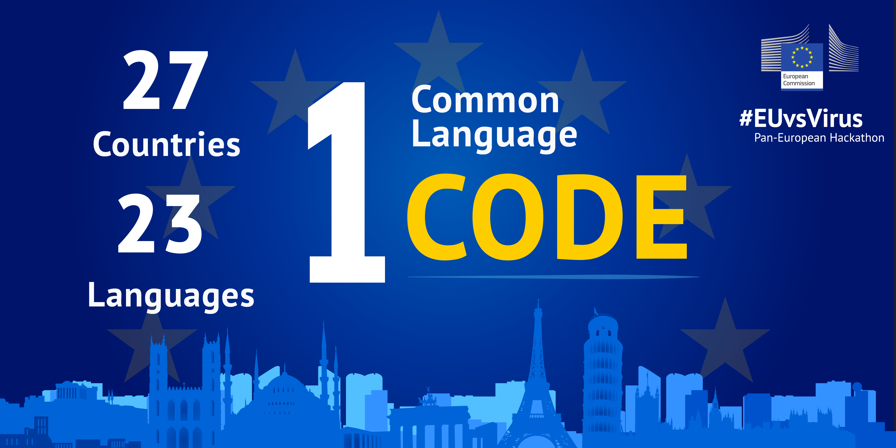

[EUvsVirus](https://euvsvirus.org/) hackathon just completed with the amazing support of more than 500 volunteers and 1,500 mentors which brought together more than 20,000 participants and produced more than 2,100 projects. People from different countries, backgrounds, and professions who would have otherwise never met, came together and blended through the magnetic calling power of common interest.

I love hackathons because they are very creative, fast, confusing, and powerful. It is a collaborative space where ideas are born and like-minded people come together in rapid agile-mode and produce in 48 hours or less highly innovative solutions.

The staggering speed of the 48-hour deadline creates a frenzy and an intense focus on developing and creating the solution itself. It is a pragmatist’s utopia where the actions of all team-members fall together to shape the prototype and solve a puzzle, identified a mere two days earlier.

The process is not only swift and accelerated but also highly democratic and friction-less. The [Slack](https://slack.com) platform provided an easy, smooth interaction where all participants could directly and fluidly interact with one another in over 5,000 channels!

Special thanksgiving is reserved for all organizers from European Commission and partner organizations. They did a wonderful job making this happen.

All in all, it was a pleasure to spend this amazing weekend around such a melting pot of talent and a great honor to be a mentor. I am waiting impatiently for the awards ceremony on Thursday the 30th of April. Tune in to [EUvsVirus Facebook page](https://www.facebook.com/EUvsVirus/) for the live session!

