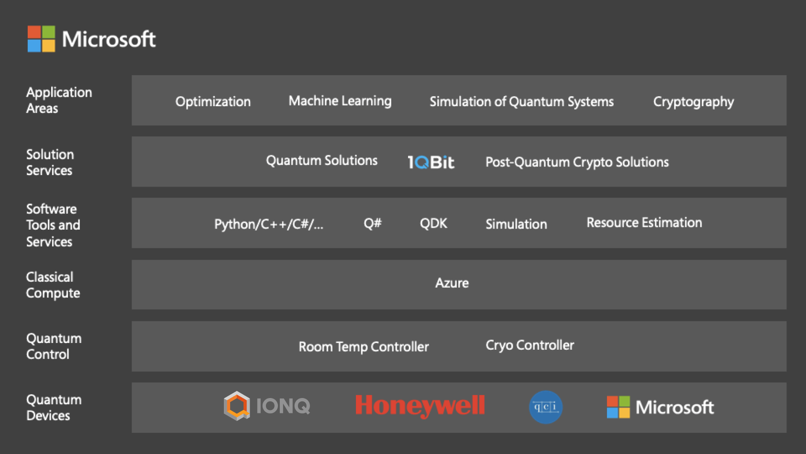

We experience the benefits of classical computing every day. However, there are challenges that today's systems will never be able to solve. For problems above a certain size and complexity, we don't have enough computational power on Earth to tackle them.

To stand a chance at solving some of these problems, we need a new kind of computing.
Current computers manipulate individual bits, which store information as binary 0 and 1 states. Quantum computers leverage the quantum mechanical phenomena of superposition and entanglement to create states that scale exponentially with number of qubits, or quantum bits.

Microsoft has spent an extended amount of time working on developing its own quantum computing technologies, including an alternative qubit technology, the topological qubit. However, Microsoft has yet to release its own quantum computing hardware. Thus, Microsoft collaborated with four different organizations - Honeywell, IonQ, QCI and 1QBit to create [Azure Quantum](https://azure.microsoft.com/en-us/services/quantum/).

Azure Quantum is a full-stack cloud service designed to allow users remote access to quantum computers. It focuses on integrating quantum computing tools and its Azure cloud service. With Azure Quantum, users will be provided with software that enables customers to write code that can run on quantum hardware.

The key features of Azure Quantum include:

* Microsoft's Quantum Development Kit (QDK), a wide range of open source tools which give developers everything they need to start writing quantum programs
* Q#, a programming language for expressing quantum algorithms, which integrates well with Visual Studio and Visual Studio Code
* Scaling, security and support inherited from Microsoft Azure platform
* Prebuild algorithms
* Quantum simulators and resource estimation tools
* Honeywell, IonQ and QCI hardware that implements a quantum processor
* 1QBit software that connects the OpenQEMIST (Quantum-Enabled Molecular ab Initio Simulation Toolkit) platform to the QDK
  

Azure Quantum is currently in private preview. You can request early access, although it is highly unlikely you will get it. (yes, i tried many times! 😅)

Happy coding! 👾
